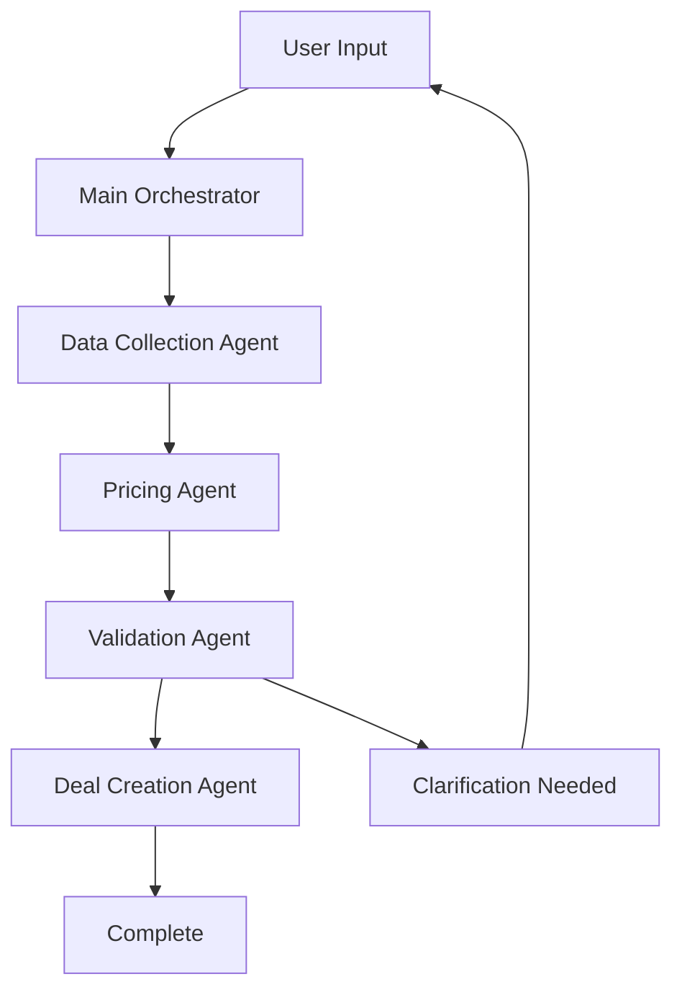

# CLAUDE.md - QDE Agent System

## Project Overview

The **QDE (Quick Data Entry) Agent System** is an AI-powered multi-agent system that transforms natural language descriptions into complete energy trade deals. The system automates the complex process of deal creation by intelligently gathering market data, calculating pricing, validating business rules, and submitting deals to the Alliance Energy trading platform.

### Primary Goal
**Transform this:** "Create a deal with ABC Trading for 5000 gallons from Houston to Dallas, monthly delivery"
**Into this:** Complete validated trade deal submitted to Alliance Energy API with:
- ✅ Verified counterparty information
- ✅ Current market pricing (OPIS data)
- ✅ Location differentials calculated  
- ✅ Business rules validated
- ✅ Deal confirmed in trading system

Built on the [PocketFlow](https://github.com/The-Pocket/PocketFlow-Typescript) framework with [Model Context Protocol (MCP)](https://github.com/anthropics/mcp) integration for seamless API bridging.

## Architecture Overview

```
┌─────────────────┐    ┌──────────────────────┐    ┌─────────────────────┐
│     User        │───▶│   Main Orchestrator   │───▶│  Alliance Energy    │
│  (Natural Lang) │    │     Agent            │    │      API            │
└─────────────────┘    └──────────────────────┘    │ (localhost:5000)    │
                                │                   └─────────────────────┘
                    ┌───────────┼───────────┐                    ▲
                    ▼           ▼           ▼                    │
          ┌─────────────┐ ┌───────────┐ ┌─────────────┐         │
          │Data Collection│ │  Pricing  │ │ Validation  │         │
          │    Agent    │ │   Agent   │ │    Agent    │         │
          └─────────────┘ └───────────┘ └─────────────┘         │
                    │           │           │                    │
                    └───────────┼───────────┘                    │
                                ▼                                │
                    ┌──────────────────────┐                    │
                    │     MCP Server       │────────────────────┘
                    │   (4 Unified Tools)  │
                    │ ┌──────────────────┐ │
                    │ │search-trade-ref  │ │  
                    │ │get-market-pricing│ │
                    │ │calculate-pricing │ │
                    │ │manage-deals      │ │
                    │ └──────────────────┘ │
                    └──────────────────────┘
```

## PocketFlow Integration

### Core Classes Used
- **`Node`**: Base class for all agents with prep→exec→post lifecycle
- **`Flow`**: Orchestrates agent execution with action-based transitions
- **Shared State**: `DealState` object passed between all agents

### Node Lifecycle Pattern
```typescript
class ExampleAgent extends Node<DealState> {
  async prep(shared: DealState): Promise<InputData> {
    // Read and preprocess data from shared state
    return preparedData;
  }

  async exec(prepRes: InputData): Promise<OutputData> {
    // Execute business logic (LLM calls, calculations)
    return processedData;
  }

  async post(shared: DealState, prepRes: InputData, execRes: OutputData): Promise<string> {
    // Update shared state and return next action
    shared.someField = execRes;
    return 'next_agent';
  }
}
```

## Project Structure

```
qde-agent/
├── CLAUDE.md                   # This file - project summary
├── README.md                   # User-facing documentation
├── design.md                   # Technical design document
├── package.json                # Node.js dependencies and scripts
├── tsconfig.json              # TypeScript configuration
├── jest.config.js             # Test configuration
├── .env.example               # Environment variables template
│
├── src/                       # Core source code
│   ├── pocket-flow.ts         # PocketFlow base classes
│   ├── index.ts               # Main application entry point
│   ├── types/                 # TypeScript type definitions
│   │   └── index.ts           # All interfaces and types
│   ├── nodes/                 # Custom node implementations
│   ├── flows/                 # Workflow definitions
│   └── utils/                 # Utility functions
│
├── agents/                    # Specialized agent implementations
│   ├── data-collection/       # Reference data gathering
│   │   └── index.ts           # ✅ Implemented
│   ├── pricing/              # Market pricing and calculations
│   ├── validation/           # Business rule validation
│   └── deal-creation/        # Final deal assembly
│
├── mcp/                      # Model Context Protocol integration
│   ├── server/               # MCP server implementation
│   │   └── index.ts          # ✅ Main server with 4 tools
│   ├── tools/                # MCP tool implementations
│   │   ├── base-tool.ts      # ✅ Base class for all tools
│   │   ├── reference-data.ts # ✅ Companies, locations, frequencies
│   │   ├── pricing.ts        # ✅ Price components, OPIS data
│   │   ├── calculations.ts   # ✅ Pricing calculations
│   │   └── deal-management.ts# ✅ Deal CRUD operations
│   └── schemas/              # JSON schemas for validation
│
├── tests/                    # Test suite
│   └── basic-setup.test.ts   # ✅ Core functionality tests
├── docs/                     # Additional documentation
└── examples/                 # Usage examples and demos
```

## Alliance Energy API Integration

### Target Platform
The QDE Agent System integrates with the **Alliance Energy** trading platform - a comprehensive .NET Core API that manages energy commodity trading operations. The system connects to Alliance Energy's QDE (Quick Data Entry) endpoints for real-time market data and deal execution.

### API Endpoints (localhost:5000)
The system integrates with 11 Alliance Energy QDE API endpoints:

**Reference Data:**
- `GET /api/fake/tradeentry/externalcompanies` - Trading counterparties and companies
- `GET /api/fake/tradeentry/customoriginlocations` - Pickup/supply locations  
- `GET /api/fake/tradeentry/customdestinationlocations` - Delivery/destination points
- `GET /api/fake/tradeentry/customfrequencyvalues` - Delivery frequencies (daily, weekly, monthly)

**Market Pricing Data:**
- `GET /api/fake/tradeentry/pricecomponents/{id}` - Product pricing components
- `GET /api/fake/tradeentry/pricepublishers` - Market data publishers (OPIS, Platts, Argus)
- `GET /api/fake/tradeentry/previousaverageopisprice` - Historical OPIS market prices
- `GET /api/fake/tradeentry/customindexpricetypes` - Available pricing index types

**Pricing Calculations:**
- `GET /api/fake/tradeentry/bookfromlocation/{id}` - Location booking details
- `POST /api/fake/tradeentry/locationdiffpricedefault` - Location price differentials
- `POST /api/fake/tradeentry/basepricedefault` - Base pricing calculations

### API Configuration
```env
# Alliance Energy API Configuration
QDE_API_BASE_URL=http://localhost:5000
QDE_API_KEY=your-alliance-energy-api-key
MCP_SERVER_PORT=3001

# Development Setup
ALLIANCE_ENERGY_PATH=/Users/nickbrooks/work/alliance-energy
```

### Running Alliance Energy API
```bash
cd /Users/nickbrooks/work/alliance-energy
./run-webapi-standalone.sh
```
This starts the .NET Core API with Swagger documentation at `http://localhost:5000/swagger`

## MCP Server Architecture

The MCP server acts as a bridge between the QDE agents and Alliance Energy API, providing 4 unified tools optimized for Claude Code integration.

### 🚨 **Claude Code Usage Instructions**

**IMPORTANT**: When using QDE MCP tools, Claude Code should:
- ✅ **Use tools directly** and return the data found
- ✅ **Report results immediately** without creating files
- ❌ **Do NOT create new files** unless explicitly requested
- ❌ **Do NOT save data to files** automatically
- 📋 **Simply display the information** retrieved from Alliance Energy API

**Example Behavior**:
```
User: "Find companies with Energy in the name"
Claude: [Uses search-trade-reference-data tool]
Claude: "Found 3 companies: Alliance Energy Partners (ID: 1005), Energy Solutions LLC (ID: 1004), Global Energy Corp (ID: 1003)"
```

**NOT This**:
```
Claude: "I'll save this company data to a file for you..."
```

### 4 Unified Tool Groups (✅ Enhanced for Claude Code)

#### 1. `search-trade-reference-data`
**Purpose**: Search and retrieve trading reference data - find companies by name, get trading locations, and fetch deal frequency options
```typescript
// Enhanced with better descriptions and validation
{
  "name": "search-trade-reference-data",
  "arguments": {
    "type": "companies" | "origin-locations" | "destination-locations" | "frequencies",
    "showFiltered": false,        // For locations: include inactive locations
    "getByPrimaryMarketer": false // For companies: filter by primary marketer
  }
}
```

#### 2. `get-market-pricing-data`
**Purpose**: Retrieve current market pricing information - get price components, find price publishers (OPIS, Platts), fetch historical prices, and get pricing methods
```typescript
// Enhanced with conditional validation and pattern matching
{
  "name": "get-market-pricing-data",
  "arguments": {
    "type": "price-components" | "price-publishers" | "opis-price" | "price-types",
    "id": 100,                    // Required for price-components
    "locationId": 100,            // Required for opis-price
    "productId": 5,               // Required for opis-price  
    "fromDateString": "2024-01-15", // Required for opis-price (YYYY-MM-DD)
    "pricePublisherId": 1         // Required for price-types
  }
}
```

#### 3. `calculate-trade-pricing`
**Purpose**: Perform pricing calculations for trade deals - calculate location differentials, compute base pricing, and determine booking details
```typescript
// Enhanced with detailed parameter descriptions and constraints
{
  "name": "calculate-trade-pricing",
  "arguments": {
    "type": "location-diff-price" | "base-price-default" | "book-from-location",
    "locationId": 100,            // Required for all calculations
    "productId": 1,               // Required for pricing calculations
    "quantities": [1000, 2000],   // Required for location-diff-price (min 1 item)
    "priceDictionary": {},        // Required for base-price-default
    "frequencyType": "monthly"    // Required for base-price-default
  }
}
```

#### 4. `manage-trade-deals`
**Purpose**: Create new trade deals, update existing deals, retrieve deal information, or delete deals from the trading system
```typescript
// Enhanced with deal structure validation and ID pattern matching
{
  "name": "manage-trade-deals",
  "arguments": {
    "action": "create" | "update" | "get" | "delete",
    "dealData": {               // Required for create/update
      "counterparty": "ABC Trading Company",
      "product": "Gasoline Regular Unleaded", 
      "quantity": 5000,
      "originLocation": "Houston Terminal",
      "destinationLocation": "Dallas Hub",
      "frequency": "monthly",
      "pricing": { /* pricing structure */ }
    },
    "dealId": "QDE-XXXXX-YYYY-ZZZZ"  // Required for update/get/delete
  }
}
```

### MCP Enhancement Features ✅

**Improved Claude Code Integration:**
- ✅ **Action-oriented descriptions**: Tools explain what they do in context
- ✅ **Conditional validation**: Schema validates required parameters by operation type  
- ✅ **Better error messages**: Include context and available tools list
- ✅ **Enhanced responses**: Structured formatting with item counts
- ✅ **Input validation**: Pattern matching, constraints, and type safety

## Specialized Subagents

### 1. Data Collection Agent ✅ (Implemented)
**File**: `agents/data-collection/index.ts`

**Responsibilities:**
- Fetch companies/counterparties via MCP
- Get origin/destination locations
- Retrieve frequency options
- Cache reference data for performance

**Flow:**
```
prep() → Identify missing reference data
exec() → Fetch data via MCP tools
post() → Update shared state → return 'pricing'
```

### 2. Pricing Agent (Ready for Implementation)
**File**: `agents/pricing/index.ts` (to be created)

**Responsibilities:**
- Access current market pricing
- Fetch historical OPIS data
- Calculate location differentials
- Compute base price defaults

**Planned Flow:**
```
prep() → Analyze pricing requirements
exec() → Calculate pricing via MCP tools
post() → Update shared state → return 'validation'
```

### 3. Validation Agent (Ready for Implementation)
**File**: `agents/validation/index.ts` (to be created)

**Responsibilities:**
- Validate deal completeness
- Check business rules
- Identify missing information
- Request user clarifications

**Planned Flow:**
```
prep() → Analyze deal completeness
exec() → Validate business rules
post() → Update validation state → return 'creation' | 'clarification'
```

### 4. Deal Creation Agent (Ready for Implementation)
**File**: `agents/deal-creation/index.ts` (to be created)

**Responsibilities:**
- Assemble final deal payload
- Submit via MCP deal-management tool
- Handle errors and retries
- Confirm successful creation

**Planned Flow:**
```
prep() → Prepare final deal payload
exec() → Submit deal via MCP
post() → Update with deal ID → return 'complete'
```

## Shared State Schema

```typescript
interface DealState {
  // User input
  userRequirements: string;
  
  // Reference data (populated by Data Collection Agent)
  companies?: Company[];
  originLocations?: Location[];
  destinationLocations?: Location[];
  frequencies?: Frequency[];
  
  // Pricing data (populated by Pricing Agent)
  priceComponents?: PriceComponent[];
  pricingCalculations?: any[];
  opisPrices?: OpisPrice[];
  
  // Deal structure (assembled by agents)
  dealData?: {
    counterparty?: string;
    originLocation?: string;
    destinationLocation?: string;
    product?: string;
    quantity?: number;
    frequency?: string;
    pricing?: PricingStructure;
  };
  
  // Workflow state
  phase: 'parsing' | 'collection' | 'pricing' | 'validation' | 'creation' | 'complete';
  missingFields?: string[];
  validationErrors?: string[];
  dealId?: string;
}
```

## Workflow Execution

### Planned Agent Flow


### Current Status
- ✅ **Data Collection Agent**: Fully implemented with mock data
- ⏳ **Pricing Agent**: Ready for implementation
- ⏳ **Validation Agent**: Ready for implementation  
- ⏳ **Deal Creation Agent**: Ready for implementation
- ✅ **MCP Server**: Complete with all 4 tool groups
- ✅ **Type System**: Complete TypeScript definitions
- ✅ **Testing**: Basic test suite passing

## Key Features

### Error Handling
- **Retry Logic**: Each agent supports configurable retries with backoff
- **Fallback Methods**: Graceful error handling via `execFallback()`
- **Circuit Breaker**: MCP tools implement timeout and error recovery

### Caching Strategy
- **Reference Data**: Companies and locations cached for performance
- **Pricing Data**: OPIS prices cached with TTL
- **State Persistence**: Shared state maintained across agent calls

### Natural Language Processing
- **Intent Recognition**: Parse user requirements into structured data
- **Missing Field Detection**: Identify incomplete information
- **Clarification Requests**: Generate specific questions for users

## Development Commands

```bash
# Install dependencies
npm install

# Run main application
npm run dev

# Start MCP server
npm run mcp-server

# Run tests
npm test
npm run test:watch

# Build for production
npm run build
```

## Environment Setup

### Prerequisites
1. **Alliance Energy API** running at `http://localhost:5000`
2. **Node.js** 18+ with npm
3. **TypeScript** for development

### Quick Start
```bash
# Start Alliance Energy API
cd /Users/nickbrooks/work/alliance-energy
./run-webapi-standalone.sh &

# Setup QDE Agent
cd /Users/nickbrooks/work/qde-agent
cp .env.example .env
npm install
npm test    # Verify setup
npm run dev # Run basic demo
```

## Integration Points

### With Alliance Energy Trading Platform
- **Target System**: .NET Core API managing energy commodity trading
- **Authentication**: Bearer token support via `QDE_API_KEY`
- **Endpoints**: All 11 QDE trade entry endpoints mapped to MCP tools
- **Real-time Data**: Live market pricing, company data, and location information
- **Error Handling**: Robust API error handling with context and retries

### With Claude Code & AI Systems
- **MCP Protocol**: Enhanced tool calling interface optimized for Claude
- **Tool Descriptions**: Action-oriented descriptions with examples
- **Input Validation**: Conditional schema validation with clear error messages
- **Response Formatting**: Structured responses with item counts and context
- **Debugging**: Enhanced error messages with available tools and parameters

### With PocketFlow Agent Framework
- **Node Compatibility**: Follows PocketFlow's prep→exec→post lifecycle patterns
- **Flow Orchestration**: Uses action-based routing ('pricing', 'validation', 'complete')
- **Shared State**: `DealState` object maintains context across all agents
- **Error Recovery**: Built-in retry logic and graceful fallback methods
- **Type Safety**: Full TypeScript integration with comprehensive interfaces

## Testing Strategy

### Current Tests ✅
- PocketFlow Node functionality
- Data Collection Agent logic
- Flow orchestration
- Error handling
- Type system validation

### Planned Tests
- MCP tool integration tests
- API endpoint mocking
- End-to-end workflow tests
- Performance benchmarks

---

## Project Status & Goals Summary

### 🎯 **Primary Mission**
Transform natural language trade requests into validated deals in the Alliance Energy trading platform through intelligent AI agent orchestration.

### ✅ **Current Status (Foundation Complete)**
- ✅ **PocketFlow Integration**: Multi-agent system with prep→exec→post lifecycle
- ✅ **Data Collection Agent**: Fully implemented with MCP integration
- ✅ **MCP Server**: 4 enhanced tools optimized for Claude Code integration
- ✅ **Alliance Energy Integration**: Connected to .NET Core trading API
- ✅ **Type System**: Comprehensive TypeScript interfaces and validation
- ✅ **Testing Framework**: Basic tests passing with workflow validation

### 🚀 **Next Development Phase**
1. **Pricing Agent**: Implement market data analysis and OPIS price integration
2. **Validation Agent**: Add business rule validation and missing field detection  
3. **Deal Creation Agent**: Complete deal assembly and submission to Alliance Energy
4. **Enhanced Error Handling**: Production-ready retry logic and fallback strategies

### 🏗️ **Architecture Strengths**
- **Scalable**: PocketFlow's minimalist design supports complex workflows
- **Testable**: Each agent and MCP tool can be independently tested
- **AI-Optimized**: Enhanced MCP tools work seamlessly with Claude Code
- **Production-Ready**: Robust error handling and Alliance Energy API integration

### 💡 **Value Proposition**
**Before**: Manual trade entry requiring expert knowledge of markets, pricing, and validation rules
**After**: "Create a deal with ABC Trading for 5000 gallons from Houston to Dallas" → Complete validated trade deal in Alliance Energy system

**Key Benefits**:
- ⚡ **Speed**: Seconds instead of minutes for deal creation
- 🎯 **Accuracy**: Automated validation reduces human error
- 📊 **Intelligence**: Real-time market pricing and calculations
- 🔄 **Scalability**: Handle multiple concurrent deal requests
- 🛡️ **Reliability**: Robust error handling and fallback mechanisms

---

## 📋 **Important Instructions for Claude Code**

When working with this QDE Agent System:

### **MCP Tool Usage Guidelines**
- ✅ **Use QDE MCP tools directly** to retrieve Alliance Energy data
- ✅ **Report findings immediately** without creating unnecessary files
- ✅ **Display results in a clear, readable format**
- ❌ **Do NOT automatically create files** when using MCP tools
- ❌ **Do NOT save data to disk** unless explicitly requested by user
- 📊 **Focus on data retrieval and analysis**, not file management

### **When to Create Files**
- ✅ **Only when user explicitly asks** to save data
- ✅ **When user requests documentation or reports**
- ✅ **When implementing new code features**
- ❌ **Never automatically** when just retrieving data

### **Example Responses**
**Good**: "Using QDE tools, I found 5 companies with 'Energy' in the name: [list results]"
**Bad**: "I'll save this company data to a file for you..." (without being asked)

**Remember**: The QDE MCP tools are for **data retrieval and analysis**, not automatic file creation.