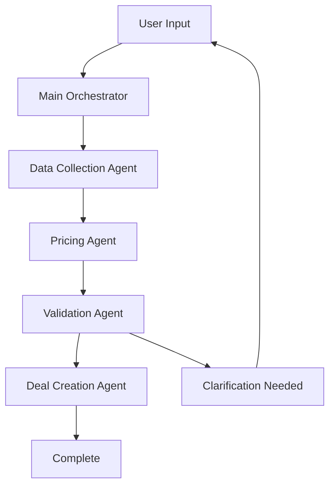

# CLAUDE.md - QDE Agent System

## Project Overview

The **QDE (Quick Data Entry) Agent System** is an AI-powered multi-agent system designed to automate energy trade deal creation through natural language processing. Built on the [PocketFlow](https://github.com/The-Pocket/PocketFlow-Typescript) framework with [Model Context Protocol (MCP)](https://github.com/anthropics/mcp) integration.

## Architecture Overview

```
┌─────────────────┐    ┌──────────────────────┐    ┌─────────────────┐
│     User        │───▶│   Main Orchestrator   │───▶│   QDE API       │
│  (Natural Lang) │    │     Agent            │    │ (localhost:8000)│
└─────────────────┘    └──────────────────────┘    └─────────────────┘
                                │                           ▲
                    ┌───────────┼───────────┐              │
                    ▼           ▼           ▼              │
          ┌─────────────┐ ┌───────────┐ ┌─────────────┐   │
          │Data Collection│ │  Pricing  │ │ Validation  │   │
          │    Agent    │ │   Agent   │ │    Agent    │   │
          └─────────────┘ └───────────┘ └─────────────┘   │
                    │           │           │              │
                    └───────────┼───────────┘              │
                                ▼                          │
                    ┌──────────────────────┐              │
                    │     MCP Server       │──────────────┘
                    │  (4 Logical Tools)   │
                    └──────────────────────┘
```

## PocketFlow Integration

### Core Classes Used
- **`Node`**: Base class for all agents with prep→exec→post lifecycle
- **`Flow`**: Orchestrates agent execution with action-based transitions
- **Shared State**: `DealState` object passed between all agents

### Node Lifecycle Pattern
```typescript
class ExampleAgent extends Node<DealState> {
  async prep(shared: DealState): Promise<InputData> {
    // Read and preprocess data from shared state
    return preparedData;
  }

  async exec(prepRes: InputData): Promise<OutputData> {
    // Execute business logic (LLM calls, calculations)
    return processedData;
  }

  async post(shared: DealState, prepRes: InputData, execRes: OutputData): Promise<string> {
    // Update shared state and return next action
    shared.someField = execRes;
    return 'next_agent';
  }
}
```

## Project Structure

```
qde-agent/
├── CLAUDE.md                   # This file - project summary
├── README.md                   # User-facing documentation
├── design.md                   # Technical design document
├── package.json                # Node.js dependencies and scripts
├── tsconfig.json              # TypeScript configuration
├── jest.config.js             # Test configuration
├── .env.example               # Environment variables template
│
├── src/                       # Core source code
│   ├── pocket-flow.ts         # PocketFlow base classes
│   ├── index.ts               # Main application entry point
│   ├── types/                 # TypeScript type definitions
│   │   └── index.ts           # All interfaces and types
│   ├── nodes/                 # Custom node implementations
│   ├── flows/                 # Workflow definitions
│   └── utils/                 # Utility functions
│
├── agents/                    # Specialized agent implementations
│   ├── data-collection/       # Reference data gathering
│   │   └── index.ts           # ✅ Implemented
│   ├── pricing/              # Market pricing and calculations
│   ├── validation/           # Business rule validation
│   └── deal-creation/        # Final deal assembly
│
├── mcp/                      # Model Context Protocol integration
│   ├── server/               # MCP server implementation
│   │   └── index.ts          # ✅ Main server with 4 tools
│   ├── tools/                # MCP tool implementations
│   │   ├── base-tool.ts      # ✅ Base class for all tools
│   │   ├── reference-data.ts # ✅ Companies, locations, frequencies
│   │   ├── pricing.ts        # ✅ Price components, OPIS data
│   │   ├── calculations.ts   # ✅ Pricing calculations
│   │   └── deal-management.ts# ✅ Deal CRUD operations
│   └── schemas/              # JSON schemas for validation
│
├── tests/                    # Test suite
│   └── basic-setup.test.ts   # ✅ Core functionality tests
├── docs/                     # Additional documentation
└── examples/                 # Usage examples and demos
```

## QDE API Integration

### API Endpoints (localhost:8000)
The system integrates with 11 mock QDE API endpoints:

**Reference Data:**
- `GET /api/fake/tradeentry/externalcompanies`
- `GET /api/fake/tradeentry/customoriginlocations`
- `GET /api/fake/tradeentry/customdestinationlocations`
- `GET /api/fake/tradeentry/customfrequencyvalues`

**Pricing Data:**
- `GET /api/fake/tradeentry/pricecomponents/{id}`
- `GET /api/fake/tradeentry/pricepublishers`
- `GET /api/fake/tradeentry/previousaverageopisprice`
- `GET /api/fake/tradeentry/customindexpricetypes`

**Calculations:**
- `GET /api/fake/tradeentry/bookfromlocation/{id}`
- `POST /api/fake/tradeentry/locationdiffpricedefault`
- `POST /api/fake/tradeentry/basepricedefault`

### API Configuration
```env
QDE_API_BASE_URL=http://localhost:8000
QDE_API_KEY=your-api-key-here
MCP_SERVER_PORT=3001
```

## MCP Server Architecture

### 4 Logical Tool Groups

#### 1. `qde-reference-data`
**Purpose**: Fetch reference data for trade deals
```typescript
// Usage
{
  "name": "qde-reference-data",
  "arguments": {
    "type": "companies" | "origin-locations" | "destination-locations" | "frequencies",
    "showFiltered": false,
    "getByPrimaryMarketer": false
  }
}
```

#### 2. `qde-pricing`
**Purpose**: Get market pricing and OPIS data
```typescript
// Usage
{
  "name": "qde-pricing", 
  "arguments": {
    "type": "price-components" | "price-publishers" | "opis-price" | "price-types",
    "locationId": 100,
    "productId": 5,
    "fromDateString": "2024-01-15"
  }
}
```

#### 3. `qde-calculations`
**Purpose**: Perform pricing calculations
```typescript
// Usage
{
  "name": "qde-calculations",
  "arguments": {
    "type": "location-diff-price" | "base-price-default" | "book-from-location",
    "locationId": 100,
    "productId": 1,
    "quantities": [1000, 2000, 3000]
  }
}
```

#### 4. `qde-deal-management`
**Purpose**: Create and manage deals
```typescript
// Usage
{
  "name": "qde-deal-management",
  "arguments": {
    "action": "create" | "update" | "get" | "delete",
    "dealData": { /* deal payload */ },
    "dealId": "DEAL-123"
  }
}
```

## Specialized Subagents

### 1. Data Collection Agent ✅ (Implemented)
**File**: `agents/data-collection/index.ts`

**Responsibilities:**
- Fetch companies/counterparties via MCP
- Get origin/destination locations
- Retrieve frequency options
- Cache reference data for performance

**Flow:**
```
prep() → Identify missing reference data
exec() → Fetch data via MCP tools
post() → Update shared state → return 'pricing'
```

### 2. Pricing Agent (Ready for Implementation)
**File**: `agents/pricing/index.ts` (to be created)

**Responsibilities:**
- Access current market pricing
- Fetch historical OPIS data
- Calculate location differentials
- Compute base price defaults

**Planned Flow:**
```
prep() → Analyze pricing requirements
exec() → Calculate pricing via MCP tools
post() → Update shared state → return 'validation'
```

### 3. Validation Agent (Ready for Implementation)
**File**: `agents/validation/index.ts` (to be created)

**Responsibilities:**
- Validate deal completeness
- Check business rules
- Identify missing information
- Request user clarifications

**Planned Flow:**
```
prep() → Analyze deal completeness
exec() → Validate business rules
post() → Update validation state → return 'creation' | 'clarification'
```

### 4. Deal Creation Agent (Ready for Implementation)
**File**: `agents/deal-creation/index.ts` (to be created)

**Responsibilities:**
- Assemble final deal payload
- Submit via MCP deal-management tool
- Handle errors and retries
- Confirm successful creation

**Planned Flow:**
```
prep() → Prepare final deal payload
exec() → Submit deal via MCP
post() → Update with deal ID → return 'complete'
```

## Shared State Schema

```typescript
interface DealState {
  // User input
  userRequirements: string;
  
  // Reference data (populated by Data Collection Agent)
  companies?: Company[];
  originLocations?: Location[];
  destinationLocations?: Location[];
  frequencies?: Frequency[];
  
  // Pricing data (populated by Pricing Agent)
  priceComponents?: PriceComponent[];
  pricingCalculations?: any[];
  opisPrices?: OpisPrice[];
  
  // Deal structure (assembled by agents)
  dealData?: {
    counterparty?: string;
    originLocation?: string;
    destinationLocation?: string;
    product?: string;
    quantity?: number;
    frequency?: string;
    pricing?: PricingStructure;
  };
  
  // Workflow state
  phase: 'parsing' | 'collection' | 'pricing' | 'validation' | 'creation' | 'complete';
  missingFields?: string[];
  validationErrors?: string[];
  dealId?: string;
}
```

## Workflow Execution

### Planned Agent Flow


### Current Status
- ✅ **Data Collection Agent**: Fully implemented with mock data
- ⏳ **Pricing Agent**: Ready for implementation
- ⏳ **Validation Agent**: Ready for implementation  
- ⏳ **Deal Creation Agent**: Ready for implementation
- ✅ **MCP Server**: Complete with all 4 tool groups
- ✅ **Type System**: Complete TypeScript definitions
- ✅ **Testing**: Basic test suite passing

## Key Features

### Error Handling
- **Retry Logic**: Each agent supports configurable retries with backoff
- **Fallback Methods**: Graceful error handling via `execFallback()`
- **Circuit Breaker**: MCP tools implement timeout and error recovery

### Caching Strategy
- **Reference Data**: Companies and locations cached for performance
- **Pricing Data**: OPIS prices cached with TTL
- **State Persistence**: Shared state maintained across agent calls

### Natural Language Processing
- **Intent Recognition**: Parse user requirements into structured data
- **Missing Field Detection**: Identify incomplete information
- **Clarification Requests**: Generate specific questions for users

## Development Commands

```bash
# Install dependencies
npm install

# Run main application
npm run dev

# Start MCP server
npm run mcp-server

# Run tests
npm test
npm run test:watch

# Build for production
npm run build
```

## Environment Setup

### Prerequisites
1. **QDE API** running at `http://localhost:8000`
2. **Node.js** 18+ with npm
3. **TypeScript** for development

### Quick Start
```bash
cd qde-agent
cp .env.example .env
npm install
npm test    # Verify setup
npm run dev # Run basic demo
```

## Integration Points

### With Existing QDE API
- **Authentication**: Bearer token support via `QDE_API_KEY`
- **Endpoints**: All 11 mock endpoints mapped to MCP tools
- **Error Handling**: Robust API error handling and retries

### With Claude/LLM Systems
- **MCP Protocol**: Standard tool calling interface
- **Tool Descriptions**: Rich schemas for LLM understanding
- **Response Formatting**: Structured JSON responses

### With PocketFlow Ecosystem
- **Node Compatibility**: Follows PocketFlow node patterns
- **Flow Orchestration**: Uses PocketFlow's action-based routing
- **Type Safety**: Full TypeScript integration

## Testing Strategy

### Current Tests ✅
- PocketFlow Node functionality
- Data Collection Agent logic
- Flow orchestration
- Error handling
- Type system validation

### Planned Tests
- MCP tool integration tests
- API endpoint mocking
- End-to-end workflow tests
- Performance benchmarks

---

**Status**: Foundation complete, ready for specialized agent implementation
**Next Steps**: Implement Pricing, Validation, and Deal Creation agents
**Architecture**: Scalable, testable, following PocketFlow best practices