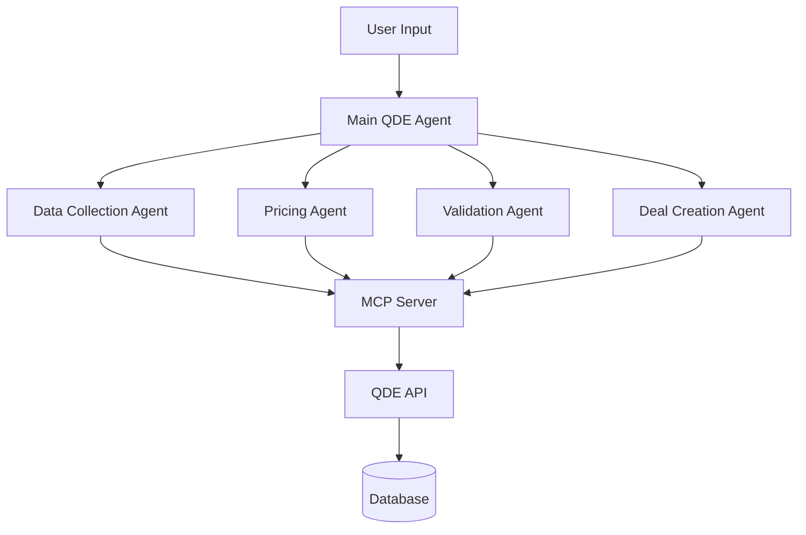

# QDE Agent System Design

## Overview

The QDE (Quick Data Entry) Agent System is an AI-powered agent architecture built on PocketFlow that automates energy trade deal creation through specialized subagents and MCP (Model Context Protocol) integration.

## Architecture



## Core Components

### 1. Main QDE Agent (Orchestrator)
- **Purpose**: Orchestrates the deal creation workflow
- **Responsibilities**:
  - Parse user requirements
  - Coordinate between specialized agents
  - Handle user interactions and clarifications
  - Manage workflow state

### 2. Specialized Subagents

#### Data Collection Agent
- **Purpose**: Gather reference data needed for deal creation
- **Tools**: `qde-reference-data`
- **Responsibilities**:
  - Fetch companies/counterparties
  - Get origin/destination locations
  - Retrieve frequency values
  - Cache reference data for reuse

#### Pricing Agent
- **Purpose**: Handle all pricing calculations and market data
- **Tools**: `qde-pricing`
- **Responsibilities**:
  - Get price components and publishers
  - Fetch OPIS historical prices
  - Calculate location differentials
  - Compute base price defaults

#### Validation Agent
- **Purpose**: Validate deal completeness and business rules
- **Tools**: `qde-calculations`
- **Responsibilities**:
  - Validate required fields are present
  - Check business rule compliance
  - Identify missing information
  - Request clarifications from user

#### Deal Creation Agent
- **Purpose**: Assemble and submit final deal
- **Tools**: `qde-deal-management`
- **Responsibilities**:
  - Create deal payload
  - Submit to API
  - Handle errors and retries
  - Confirm deal creation

### 3. MCP Server
- **Purpose**: Bridge between agents and QDE API
- **Tools**:
  - `qde-reference-data`: Companies, locations, frequencies
  - `qde-pricing`: Price components, publishers, OPIS data
  - `qde-calculations`: Location diff, base price calculations
  - `qde-deal-management`: Deal CRUD operations

## Workflow

### Phase 1: Initial Processing
1. User provides deal requirements (natural language)
2. Main Agent parses requirements
3. Identifies missing information
4. Routes to appropriate specialized agents

### Phase 2: Data Collection
1. Data Collection Agent gathers reference data
2. Caches frequently used data (companies, locations)
3. Returns structured data to Main Agent

### Phase 3: Pricing Analysis
1. Pricing Agent analyzes market conditions
2. Fetches historical OPIS data if needed
3. Calculates location differentials
4. Computes base pricing

### Phase 4: Validation
1. Validation Agent checks completeness
2. Validates business rules
3. Identifies gaps and requests clarifications
4. Loops back to collection/pricing if needed

### Phase 5: Deal Creation
1. Deal Creation Agent assembles final payload
2. Submits to API via MCP
3. Handles errors and retries
4. Confirms successful creation

## Shared State Schema

```typescript
interface DealState {
  // User input
  userRequirements: string;
  
  // Reference data
  companies?: Company[];
  originLocations?: Location[];
  destinationLocations?: Location[];
  frequencies?: Frequency[];
  
  // Pricing data
  priceComponents?: PriceComponent[];
  pricingCalculations?: PricingResult[];
  
  // Deal structure
  dealData?: {
    counterparty?: string;
    originLocation?: string;
    destinationLocation?: string;
    product?: string;
    quantity?: number;
    frequency?: string;
    pricing?: PricingStructure;
  };
  
  // Workflow state
  phase: 'parsing' | 'collection' | 'pricing' | 'validation' | 'creation' | 'complete';
  missingFields?: string[];
  validationErrors?: string[];
  dealId?: string;
}
```

## Error Handling

### Retry Logic
- Each agent implements retry logic with exponential backoff
- MCP calls have circuit breaker pattern
- Failed operations are logged and reported

### Fallback Strategies
- If external data unavailable, use cached/default values
- Graceful degradation for non-critical validations
- User notification for critical failures

## Success Criteria

1. **User Experience**:
   - Natural language input processing
   - Clear clarification requests
   - Progress updates during processing

2. **Data Accuracy**:
   - Correct reference data fetching
   - Accurate pricing calculations
   - Valid deal structures

3. **Reliability**:
   - Graceful error handling
   - Retry mechanisms
   - Data consistency

4. **Performance**:
   - Parallel agent execution where possible
   - Efficient caching
   - Sub-30 second deal creation

## Implementation Plan

### Phase 1: Foundation
- [ ] Set up PocketFlow base classes
- [ ] Create MCP server with basic tools
- [ ] Implement shared state schema

### Phase 2: Core Agents
- [ ] Data Collection Agent
- [ ] Pricing Agent
- [ ] Basic workflow orchestration

### Phase 3: Advanced Features
- [ ] Validation Agent
- [ ] Deal Creation Agent
- [ ] Error handling and retries

### Phase 4: Polish
- [ ] Caching optimization
- [ ] User experience improvements
- [ ] Testing and validation